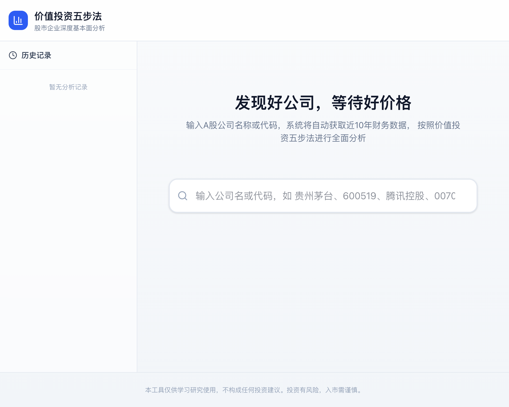
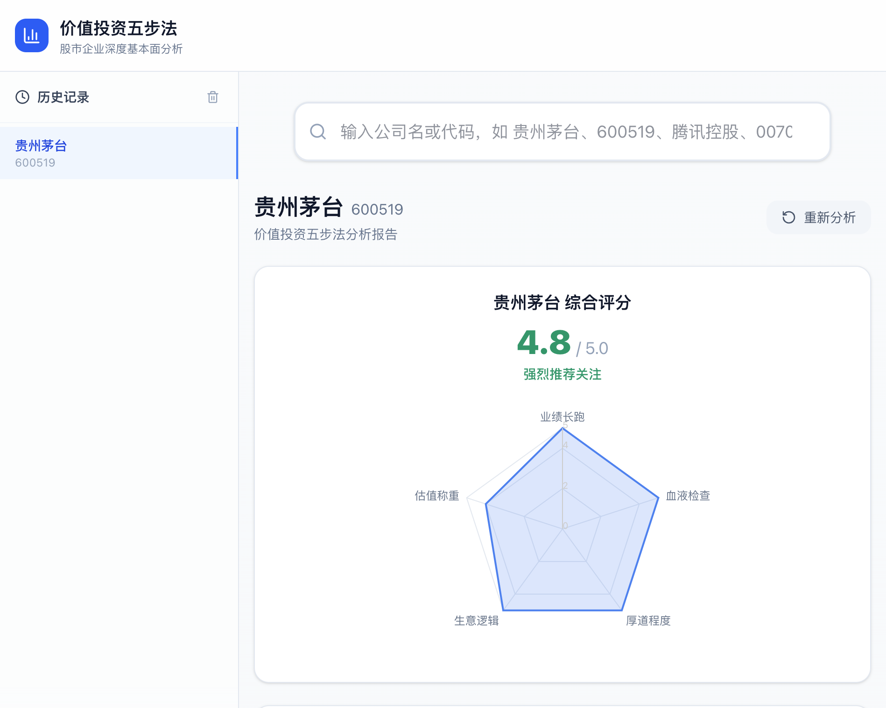
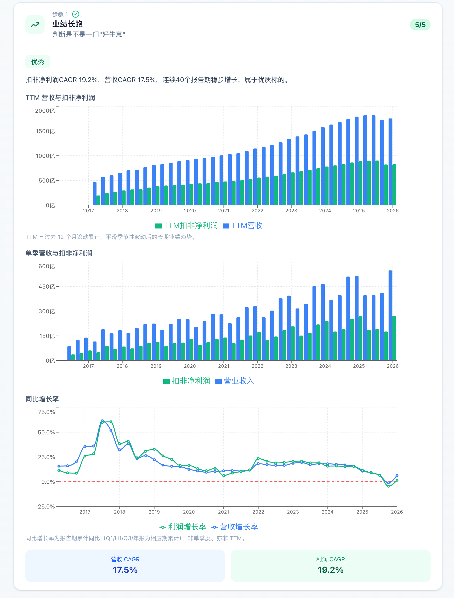
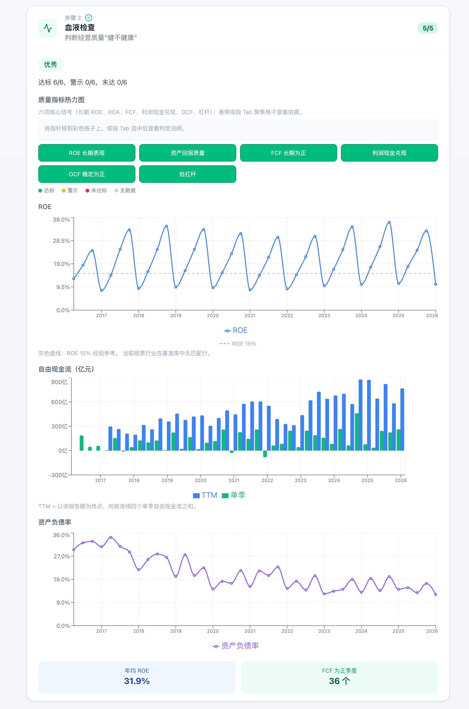
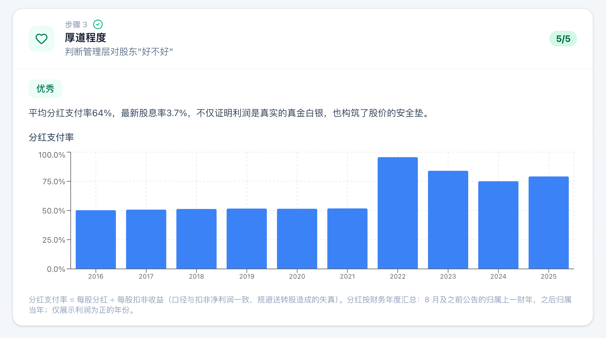
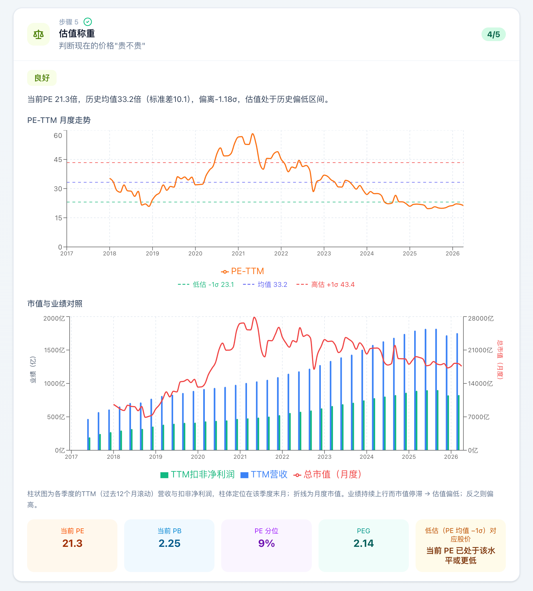
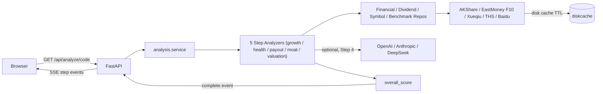

# 价值投资五步法 · Invest Researcher

> 面向 A 股 / 港股的「价值投资五步法」深度基本面分析 Web App。
> 输入股票代码，自动拉取近 10 年财务数据，通过分析公司的业绩和市值，回答公司是否持续增长，以及当前的价格是否提供足够的安全边际。


---

## 核心亮点

- **价值投资五步法评分** — 业绩长跑、血液检查、厚道程度、生意逻辑（参考项不计入综合分）、估值称重；五维雷达图直观呈现。
- **多数据源融合** — AKShare + 东方财富 F10 + 雪球 + 同花顺 + 百度等，并对数据源进行缓存，提升数据获取速度。
- **AI增强** — Agent自动获取市场信息，评定生意逻辑（护城河）等指标。

---

## 界面预览

### 首页 — 简洁的搜索入口



### 综合评分 + 五维雷达图



### Step 1 业绩长跑 — TTM 滚动 / 单季 / 同比三视角



### Step 2 血液检查 — 六项核心信号热力图



### Step 3 厚道程度 — 分红支付率 / 股息率



### Step 4 生意逻辑 — 毛利率 / 静利率


### Step 5 估值称重 — PE-TTM 历史走势叠加 σ 带



---

## 技术栈

| 分层 | 技术 |
| ---- | ---- |
| **后端框架** | FastAPI · Uvicorn · sse-starlette · Pydantic v2 |
| **前端框架** | React 19 · React Router 7 · Vite 8 · TypeScript |
| **可视化 / 样式** | Recharts · Tailwind CSS v4 · Lucide Icons |
| **金融数据** | AKShare · 东方财富 F10（直连 HTTP）· 雪球 / 同花顺 / 百度 |
| **存储** | SQLite（股票符号库）· diskcache（外部 API 磁盘缓存） |
| **报表导出** | openpyxl |
| **LLM（可选）** | OpenAI · Anthropic · DeepSeek（通过 `LLM_PROVIDER` 切换） |
| **包管理** | `uv`（Python） · `npm`（前端） |
| **容器化** | Docker Compose（dev profile：Vite 5173 → FastAPI 8000） |

---

## 快速开始

### 前置依赖

- Python 3.11+
- Node.js 20+ 与 `npm`
- [uv](https://docs.astral.sh/uv/) — `curl -LsSf https://astral.sh/uv/install.sh | sh`
- 可选：Docker 24+（如果走容器路线）

### 路线 A — 本地开发

```bash
git clone https://github.com/<your-fork>/invest-reasearcher.git
cd invest-reasearcher

cp .env.example .env

uv sync

cd frontend && npm install && cd ..

uv run start
```

`uv run start` 会同时拉起后端（`http://localhost:8000`）与前端（`http://localhost:5173`），见 [scripts/dev.py](scripts/dev.py)。打开浏览器访问 `http://localhost:5173`。


---

## 项目结构

```text
invest-reasearcher/
├── backend/
│   ├── api/                      # FastAPI routes / DTO / SSE / Excel 导出
│   ├── application/analysis/     # 五步分析编排、context、step registry
│   │   └── steps/                # growth_track / financial_health / payout / moat / valuation
│   ├── domain/                   # 纯领域逻辑：财务、质量、估值、分红
│   ├── infrastructure/
│   │   ├── sources/              # AKShare / 东财 F10 / 雪球 / 同花顺 / 百度 等数据源
│   │   ├── akshare_client.py     # 重试 + 限速封装
│   │   └── disk_cache.py         # 统一磁盘缓存与 TTL
│   ├── repositories/             # symbol / financial / dividend / industry_benchmark
│   ├── tests/                    # pytest 单测
│   ├── config.py
│   └── main.py
├── frontend/
│   ├── src/
│   │   ├── components/           # AnalysisReport / ScoreRadar / StepCard / FinancialChart
│   │   │                           QualitySignalHeatmap / SearchBar / HistorySidebar
│   │   ├── hooks/                # useHistory / useAnalyze (SSE)
│   │   ├── pages/                # HomePage / ReportPage
│   │   └── App.tsx
│   ├── package.json
│   └── vite.config.ts
├── scripts/
│   ├── dev.py                    # `uv run start` 入口，同时启动前后端
│   ├── sync_stock_symbols.py     # 拉取并写入 SQLite 符号库
│   ├── seed_industry_benchmarks.py
│   └── export_analysis_excel.py
├── docs/
│   ├── infrastructure-sources-apis.md
│   └── screenshots/
├── docker/                       # Dockerfile.backend / Dockerfile.frontend
├── docker-compose.yml
├── pyproject.toml
└── uv.lock
```

---

## 开发与测试

### 后端

```bash
uv run pytest backend/tests          # 跑全部 pytest

uv run uvicorn backend.main:app --reload   # 仅启后端

uv run python -m scripts.sync_stock_symbols       # 刷新本地 A 股 + 港股符号库
uv run python -m scripts.seed_industry_benchmarks # 写入行业基准（ROE 等参考线）
uv run python -m scripts.export_analysis_excel 600519 ./out.xlsx
```

### 前端

```bash
cd frontend
npm run dev      # Vite 开发服 (5173)
npm run build    # 生产构建 (tsc -b && vite build)
npm run lint     # ESLint
npm run preview
```

### 调用示例

```bash
curl 'http://localhost:8000/api/search?q=600519'

curl -N 'http://localhost:8000/api/analyze/sh600519'

curl -OJ 'http://localhost:8000/api/analyze/sh600519/excel'
```

---

## 数据流示意



---

## 免责声明

> 本工具仅供学习研究使用，不构成任何投资建议。所有数据来源于公开渠道，作者不对数据准确性、时效性或由此产生的任何投资决策承担责任。**投资有风险，入市需谨慎。**

---

## License

本项目采用 **[PolyForm Noncommercial License 1.0.0](LICENSE)**。

- 个人学习、研究、教学、爱好项目、公益及非营利组织：**自由使用、修改、再分发**。
- 任何商业用途（付费产品 / SaaS / 商业内部生产环境 / 商业再分发等）：**必须事先取得作者书面授权**。
- 商业授权请联系作者。

完整条款见 [LICENSE](LICENSE)。
